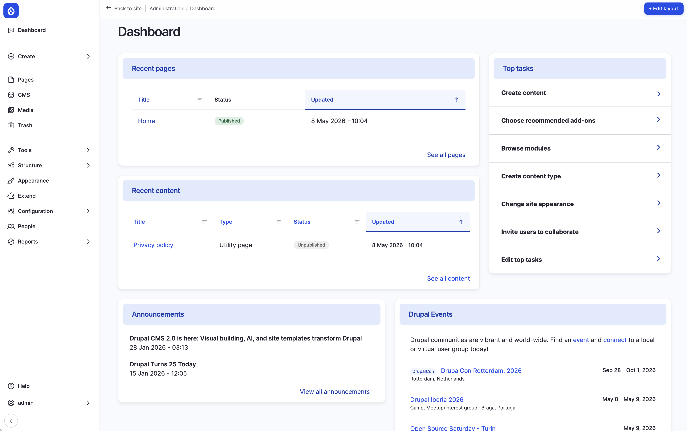

After you first install Drupal or after you login to Drupal, what appears next can be a little intimidating. A Dashboard with some recent content, a huge menu bar on the left side with what appears to be cryptic names. But don't worry, we're going to go over every item on the list and explain what's there, why it' s there and what might be more important to you than other.

*Image 6.1 - The Dashboard, as it appears after installation of Drupal CMS with the Starter Site Template*

## The <svg xmlns="http://www.w3.org/2000/svg" width="40" height="40" viewBox="0 0 32 32" role="img" aria-label="Navigation logo">
  <rect fill="#347efe" width="32" height="32" rx="8"></rect>
  <path fill="#fff" d="M19,10.3C17.67,9,16.38,7.68,16,6.23,15.62,7.67,14.33,9,13,10.3c-2,2-4.31,4.31-4.31,7.74a7.32,7.32,0,0,0,14.64,0C23.32,14.61,21,12.32,19,10.3Zm-7.22,9.44c-.45,0-2.11-2.87,1-5.91l2,2.22a.18.18,0,0,1,0,.25h0A19.3,19.3,0,0,0,12,19.6C11.92,19.75,11.83,19.74,11.79,19.74ZM16,23.51A2.52,2.52,0,0,1,13.48,21a2.56,2.56,0,0,1,.63-1.66c.45-.56,1.89-2.12,1.89-2.12s1.41,1.59,1.89,2.11A2.5,2.5,0,0,1,18.52,21,2.52,2.52,0,0,1,16,23.51Zm4.82-4.09c-.06.12-.18.32-.35.33s-.32-.14-.55-.47c-.48-.71-4.67-5.09-5.46-5.94s-.09-1.27.18-1.55L16,10.44a35.72,35.72,0,0,1,4.25,4.8A4.5,4.5,0,0,1,20.82,19.42Z"></path>
</svg> Element
On the top of the menu bar to the left resides the Drupal Icon. This is technically not an "menu-item" but a way to be always able to get back to the front page of your site, where ever you are located in the navigation tree. This can be very useful if you're are completely lost in the navigation and just want to see something familiar :-) 
## <svg width="20" height="20" fill="#787878" viewBox="0 0 256 256" class="toolbar-button__icon" aria-hidden="true">
  <path xmlns="http://www.w3.org/2000/svg" d="M216,48H40a8,8,0,0,0-8,8V208a16,16,0,0,0,16,16H88a16,16,0,0,0,16-16V160h48v16a16,16,0,0,0,16,16h40a16,16,0,0,0,16-16V56A8,8,0,0,0,216,48ZM88,208H48V128H88Zm0-96H48V64H88Zm64,32H104V64h48Zm56,32H168V128h40Zm0-64H168V64h40Z"></path>
</svg> Dashboard 
This link will take you back to the Dashboard page, the one you can see in image 6.1

## <svg width="20" height="20" viewBox="0 0 24 24" fill="none" class="toolbar-button__icon" aria-hidden="true">
  <path d="M12 2.25C10.0716 2.25 8.18657 2.82183 6.58319 3.89317C4.97982 4.96452 3.73013 6.48726 2.99218 8.26884C2.25422 10.0504 2.06114 12.0108 2.43735 13.9021C2.81355 15.7934 3.74215 17.5307 5.10571 18.8943C6.46928 20.2579 8.20656 21.1865 10.0979 21.5627C11.9892 21.9389 13.9496 21.7458 15.7312 21.0078C17.5127 20.2699 19.0355 19.0202 20.1068 17.4168C21.1782 15.8134 21.75 13.9284 21.75 12C21.7473 9.41498 20.7192 6.93661 18.8913 5.10872C17.0634 3.28084 14.585 2.25273 12 2.25ZM12 20.25C10.3683 20.25 8.77326 19.7661 7.41655 18.8596C6.05984 17.9531 5.00242 16.6646 4.378 15.1571C3.75358 13.6496 3.5902 11.9908 3.90853 10.3905C4.22685 8.79016 5.01259 7.32015 6.16637 6.16637C7.32016 5.01259 8.79017 4.22685 10.3905 3.90852C11.9909 3.59019 13.6497 3.75357 15.1571 4.37799C16.6646 5.00242 17.9531 6.05984 18.8596 7.41655C19.7662 8.77325 20.25 10.3683 20.25 12C20.2475 14.1873 19.3775 16.2843 17.8309 17.8309C16.2843 19.3775 14.1873 20.2475 12 20.25ZM16.5 12C16.5 12.1989 16.421 12.3897 16.2803 12.5303C16.1397 12.671 15.9489 12.75 15.75 12.75H12.75V15.75C12.75 15.9489 12.671 16.1397 12.5303 16.2803C12.3897 16.421 12.1989 16.5 12 16.5C11.8011 16.5 11.6103 16.421 11.4697 16.2803C11.329 16.1397 11.25 15.9489 11.25 15.75V12.75H8.25C8.05109 12.75 7.86033 12.671 7.71967 12.5303C7.57902 12.3897 7.5 12.1989 7.5 12C7.5 11.8011 7.57902 11.6103 7.71967 11.4697C7.86033 11.329 8.05109 11.25 8.25 11.25H11.25V8.25C11.25 8.05109 11.329 7.86032 11.4697 7.71967C11.6103 7.57902 11.8011 7.5 12 7.5C12.1989 7.5 12.3897 7.57902 12.5303 7.71967C12.671 7.86032 12.75 8.05109 12.75 8.25V11.25H15.75C15.9489 11.25 16.1397 11.329 16.2803 11.4697C16.421 11.6103 16.5 11.8011 16.5 12Z" fill="currentColor"></path>
</svg> Create
The create is a shortcut menu item to create new content. It has a sub menu that shows all the available content types on your Drupal instance. At the moment there is only one item, Utility Page, but as we create more 